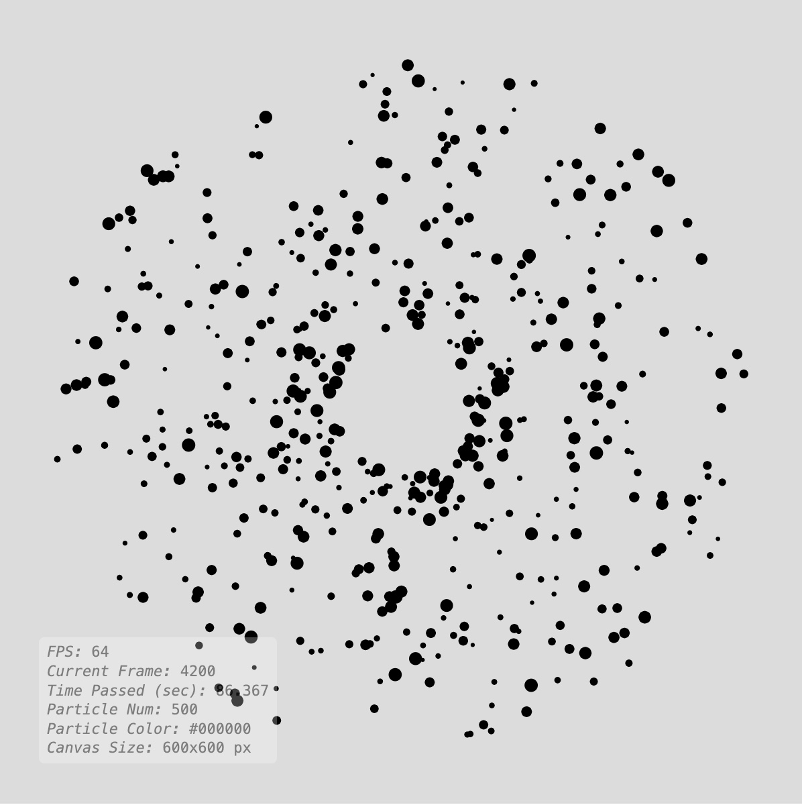
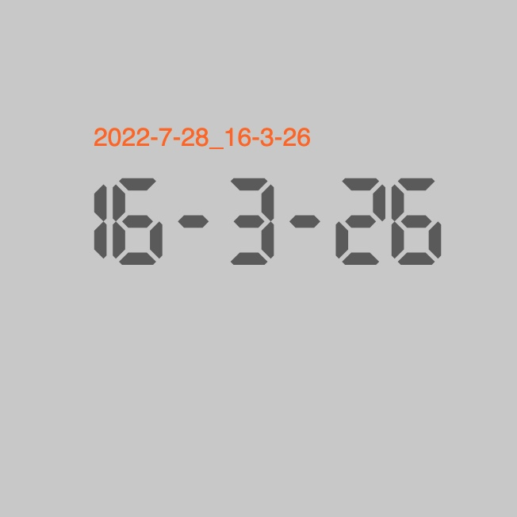
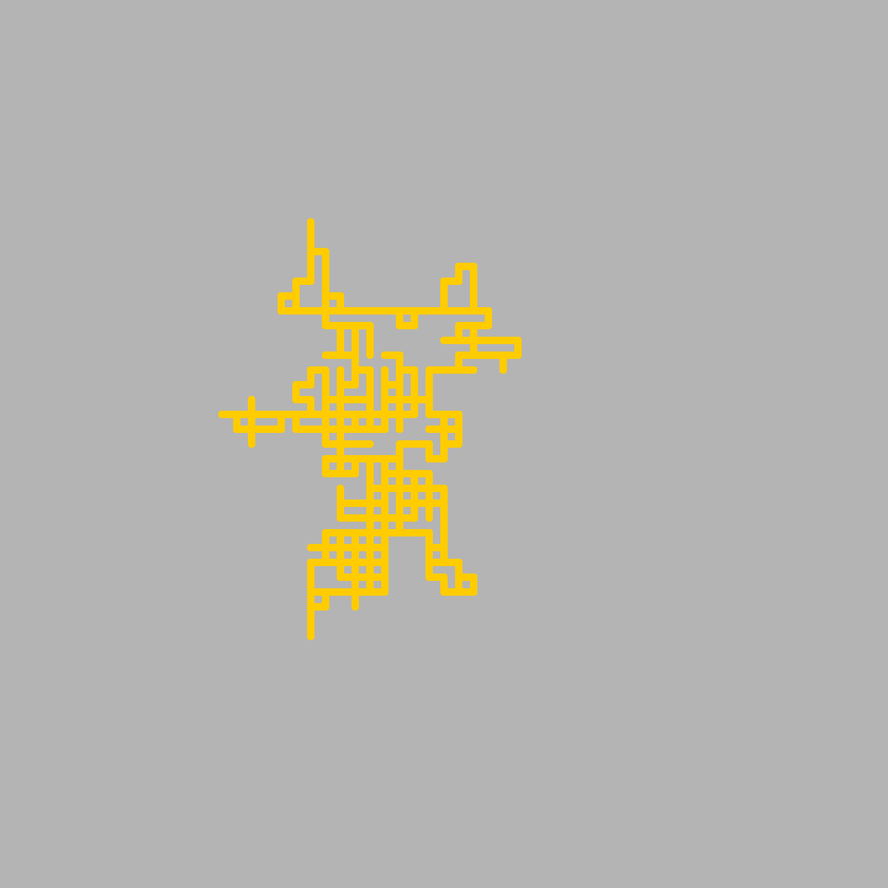
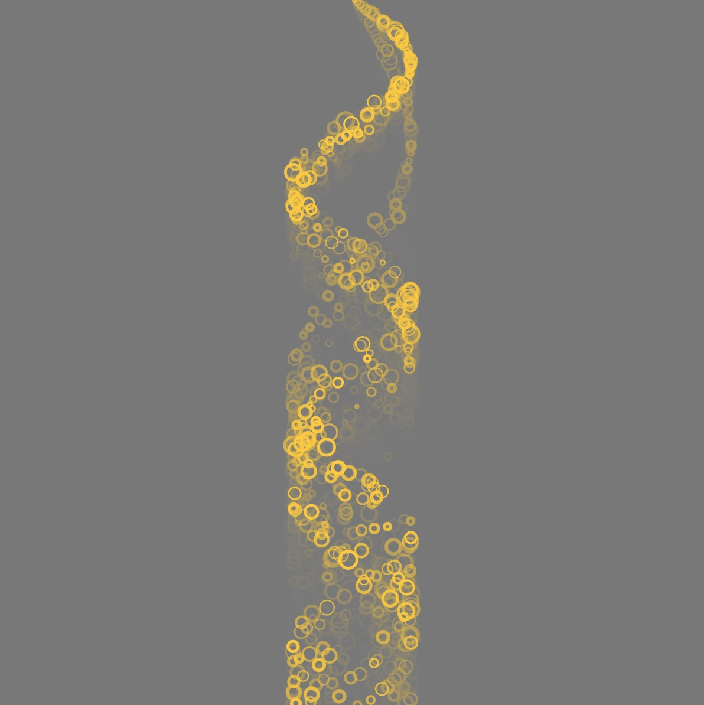
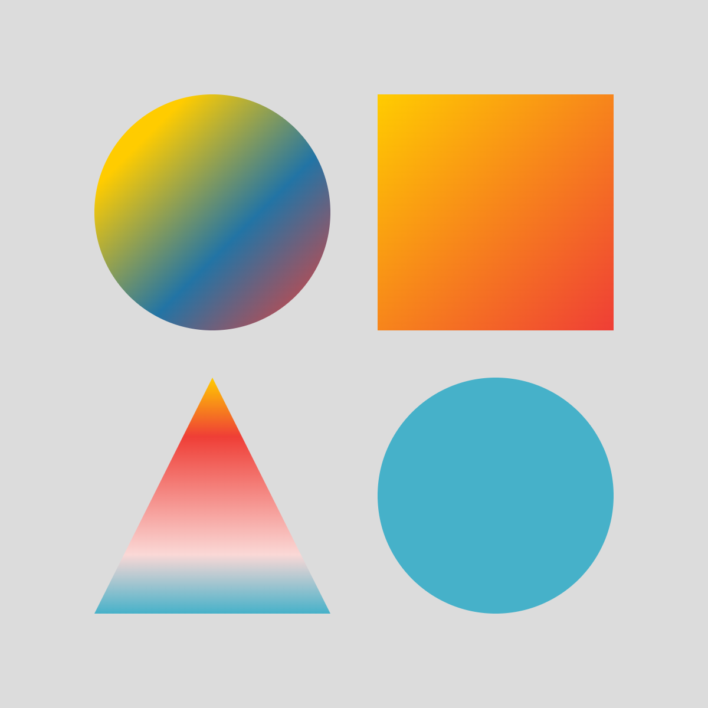
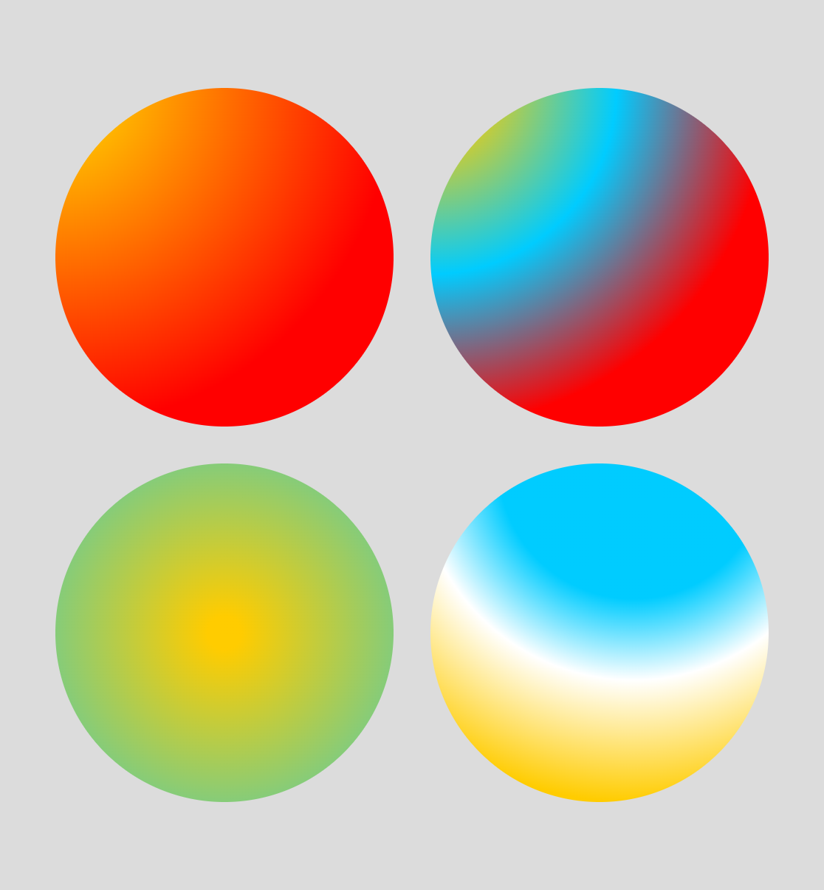

# p5.utils
 A set of utilities and additional features for my creative coding class aiming to help students while introducing the algorithmic thinking.  

## The list of utilities in p5.Utils repository. Click on thumbnails to access examples on p5JS editor;

[1_pixelRuler](https://github.com/alptugan/p5.utils/tree/main/examples/1_pixelRuler) | [2_debugView](https://github.com/alptugan/p5.utils/tree/main/examples/2_debugView) | [3_getTimeStamp](https://github.com/alptugan/p5.utils/tree/main/examples/3_getTimeStamp)
------------- | ------------- | -------------
<a href="https://github.com/alptugan/p5.utils/tree/main/examples/1_pixelRuler"></a>  | <a href="https://github.com/alptugan/p5.utils/tree/main/examples/2_debugView"></a> | <a href="https://github.com/alptugan/p5.utils/tree/main/examples/3_getTimeStamp"></a>

[4_saveCanvas](https://github.com/alptugan/p5.utils/tree/main/examples/4_saveCanvas) | [5_arrayResize](https://github.com/alptugan/p5.utils/tree/main/examples/5_arrayResize) | [6_fxShadow](https://github.com/alptugan/p5.utils/tree/main/examples/6_fxShadow)
------------- | ------------- | -------------
<a href="https://github.com/alptugan/p5.utils/tree/main/examples/4_saveCanvas"></a> | <a href="https://github.com/alptugan/p5.utils/tree/main/examples/5_arrayResize"></a> | <a href="https://github.com/alptugan/p5.utils/tree/main/examples/6_fxShadow"></a>

[7_GradientFill](https://github.com/alptugan/p5.utils/tree/main/examples/7_GradientFill) | [8_RadialGradientFill](#) | [9_Countdown](#)
------------- | ------------- | -------------
<a href="https://github.com/alptugan/p5.utils/tree/main/examples/7_GradientFill"></a>  | <a href="#"></a> | <a href="#"></a>

## How to use p5.Utils library?
---
### Option 1 (Quick Start via P5JS Online Editor)
1. [Navigate to p5JS examples collection.](https://editor.p5js.org/alptugan/collections/tUYB1Fn4b)
2. Click on p5.utils.template.
3. Hit CMD+s (or File->Save). This will create a copy of required files in your P5JS account. Whenever you need to access ```p5.utils``` you can follow the same steps.

### Option 2 (If you are using local text editor like VSCode for development)
1. Download the final minified js version from ["Releases" page](https://github.com/alptugan/p5.utils/releases/download/v0.0.1/p5.utils.min.js).
2. Upload ```p5.utils.min.js``` to your project folder in p5 editor.
3. Include the ```p5.utils.min.js``` in the ```index.html``` document before p5.js libs as follows;
     ```
     <script src="libraries/p5.min.js"></script>
     <script src="libraries/p5.sound.min.js"></script>
     <script src="libraries/p5.utils.min.js"></script>
     ```
4. Declare and initialize the lib before the ```setup()``` prefably as follows;

     ```
     var utils = new p5.Utils();
     ```
5. Now you can call any <a href="#functions">methods</a> defined in ```p5.utils``` library using dot notation as follows in ```setup()``` or any other custom methods in your code;

     ```
     utils.enablerRuler(); 
     ```
### Option 3 (Import the lib. using CDN service)
1. Include CDN source to you ```ìndex.html```.
  ```
  <script src="https://cdn.jsdelivr.net/gh/alptugan/p5.utils@latest/src/p5.utils.min.js"></script>
  ```
2. Repeat the above steps 4 and 5.

## Reference
---
### p5.Utils library
p5.Utils extends p5 with several functionalities including cheaper drawingcontext effects, pixel ruler (useful for new commers), array operations, file naming, dom based debug window to avoid rendering text in p5JS.

<a name="functions"></a>
## Functions

<dl>
<dt><a href="#debug">debug(_itemName)</a></dt>
<dd><p>Create Debug Div cause p5 font is expensive.</p>
</dd>
<dt><a href="#getTimeStamp">getTimeStamp([_date])</a> ⇒ <code>string</code></dt>
<dd><p>Timestamp function useful for file naming to avoid overwrite issues.</p>
</dd>
<dt><a href="#getRandomInt">getRandomInt(_min, _max)</a> ⇒ <code>number</code></dt>
<dd><p>Generates and returns a random integer between min and max number</p>
</dd>
<dt><a href="#saveCanvas">saveCanvas([_prefix], [_suffix])</a></dt>
<dd><p>Utilizes p5JS saveCanvas function to make it easier file saving process by combining the function with getTimeStamp() method.</p>
</dd>
<dt><a href="#arrayResize">arrayResize(_arr, _newSize, [_defaultValue])</a> ⇒ <code>Array.&lt;number&gt;</code> | <code>Array.&lt;string&gt;</code> | <code>Array.&lt;boolean&gt;</code></dt>
<dd><p>Resizes an array and returns it. Similar to vectors resize in C++.</p>
</dd>
<dt><a href="#beginShadow">beginShadow(_color, _shadowBlur, _shadowOffsetX, _shadowOffsetY)</a></dt>
<dd><p>Creates shadow effect using drawing context. Must be used with <a href="#endShadow">endShadow</a> method. See examples for how to use it.</p>
</dd>
<dt><a href="#endShadow">endShadow()</a></dt>
<dd><p>Clears shadow effect for the following graphics on the canvas. For example usage check <a href="#beginShadow">beginShadow</a>.</p>
</dd>
<dt><a href="#beginRadialGradient">beginRadialGradient(_colorsArr, _startX, _startY, _rad, [_endX], [_endY], [_rOuter], [_ratio])</a></dt>
<dd><p>Default Context 2D Radial Gradient fill style. Must be used with <a href="#endRadialGradient">endRadialGradient</a> method. See examples for how to use it.
Reference: <a><a href="https://developer.mozilla.org/en-US/docs/Web/API/CanvasRenderingContext2D/createRadialGradient">https://developer.mozilla.org/en-US/docs/Web/API/CanvasRenderingContext2D/createRadialGradient</a></a></p>
</dd>
<dt><a href="#endRadialGradient">endRadialGradient()</a></dt>
<dd><p>Stops radial gradient fill for the following graphics on the canvas. For example usage check <a href="#beginRadialGradient">beginRadialGradient</a> page.</p>
</dd>
<dt><a href="#beginLinearGradient">beginLinearGradient(_colorsArr, _startX, _startY, _endX, _endY, [_colorsRatio])</a></dt>
<dd><p>Default Context 2D Gradient fill style. Must be used with <a href="#endLinearGradient">endLinearGradient</a> method. See examples for how to use it.</p>
<p>Reference: <a><a href="https://developer.mozilla.org/en-US/docs/Web/API/CanvasRenderingContext2D/createLinearGradient">https://developer.mozilla.org/en-US/docs/Web/API/CanvasRenderingContext2D/createLinearGradient</a></a></p>
</dd>
<dt><a href="#endLinearGradient">endLinearGradient()</a></dt>
<dd><p>Stop Gradient fill for the following graphics. Must be used with <a href="#beginLinearGradient">beginLinearGradient</a> method. See examples for how to use it.</p>
</dd>
<dt><a href="#text">text(_txt, _x, _y, [_size], [_font], [_alignH], [_alighV])</a></dt>
<dd><p>Set the style and display the text in a single method. See <a href="#getTimeStamp">getTimeStamp</a> example on how to use the function.</p>
</dd>
<dt><a href="#notify">notify(_on_every_nth_second)</a> ⇒ <code>boolean</code></dt>
<dd><p>returns true every nth second in draw function</p>
</dd>
<dt><a href="#setRulerStyle">setRulerStyle([_p5rulerBgColor], [_p5rulerTxtColor], [_p5rulersize], [_p5rulerInfoColor], [_p5rulerInfoBgColor], [_p5rulerTickColor], [_p5rulerFont])</a></dt>
<dd><p>Customize the pixel ruler style. Set the colors and font options. Also customizes the <a href="#debug">debug</a> background and text colors.</p>
</dd>
<dt><a href="#disableRuler">disableRuler()</a></dt>
<dd><p>Removes the ruler graphics from the canvas.</p>
</dd>
<dt><a href="#enableRuler">enableRuler()</a></dt>
<dd><p>Ruler for newcomers to show pixel meter.</p>
</dd>
</dl>

<a name="debug"></a>

## debug(_itemName)
Create Debug Div cause p5 font is expensive.

**Kind**: global function  

| Param | Type | Description |
| --- | --- | --- |
| _itemName | <code>Object.&lt;string, number&gt;</code> \| <code>Object.&lt;string, string&gt;</code> | The argument must be in JSON data format. The function automatically parses "keys" to titles and their "values" next to them. You can add as many objects as you want. |

**Example** *(How to use debug() method.)*  
```js
// Define global variable and initialize p5.Utils lib
var utils = new p5.Utils();

utils.debug(
{
   "FPS": frameRate().toFixed(0),
   "Frequency": frequency.toFixed(3)
});
```
<a name="getTimeStamp"></a>

## getTimeStamp([_date]) ⇒ <code>string</code>
Timestamp function useful for file naming to avoid overwrite issues.

**Kind**: global function  
**Returns**: <code>string</code> - Current date + time depending on _date argument value. 

When _date = true;

The return format is Year-Month-Day_Hour-Minute-Second

When _date = false;

The return format is Hour-Minute-Second  
**See**: [text](#text)  

| Param | Type | Default | Description |
| --- | --- | --- | --- |
| [_date] | <code>boolean</code> | <code>true</code> | If true -> Timestamp within Year-Month-Day |

**Example**  
```js
// Define global variable and initialize p5.Utils lib
var utils = new p5.Utils();

// Font source:
// https://www.dafont.com/lcd-at-t-phone-time-date.font
var cutomFontName = "LCDAT&TPhoneTimeDate.ttf";

function setup() {
  createCanvas(600, 600);
  //noLoop();
}

function draw() {
  background(200);

  // get current time stamp within date
  var currentTime = utils.getTimeStamp();
  //print(currentTime);

  // write it to canvas using utils's text function 
  fill(255, 100, 20);
  utils.text(
    currentTime,        // string to display
    width * 0.5 - 100,   // x position
    height * 0.5 - 60,  // y position
    16
  );

  // get current time stamp without date
  var currentTime2 = utils.getTimeStamp(false);
  fill(90, 90, 90);
  // write it to canvas using utils's text function 
  utils.text(
    currentTime2,   // string to display
    width * 0.5,   // x position
    height * 0.5,  // y position
    80,            // fontsize
    cutomFontName,  // custom font
    CENTER,        // text alignment horizontal
    CENTER);       // text alignment vertical

}
```
<a name="getRandomInt"></a>

## getRandomInt(_min, _max) ⇒ <code>number</code>
Generates and returns a random integer between min and max number

**Kind**: global function  
**Returns**: <code>number</code> - Result will be integer  

| Param | Type | Description |
| --- | --- | --- |
| _min | <code>number</code> | Floor value of the random number |
| _max | <code>number</code> | Ceil value of the random number |

<a name="saveCanvas"></a>

## saveCanvas([_prefix], [_suffix])
Utilizes p5JS saveCanvas function to make it easier file saving process by combining the function with getTimeStamp() method.

**Kind**: global function  

| Param | Type | Default | Description |
| --- | --- | --- | --- |
| [_prefix] | <code>string</code> \| <code>number</code> | <code>&quot;\&quot;\&quot;&quot;</code> | Any relevant text in the begining of the file name. If it is leaved empty, the file name will be Year-Month-Day_Hour-Minute-Second.PNG |
| [_suffix] | <code>string</code> | <code>&quot;\&quot;png\&quot;&quot;</code> | The file extension JPG, PNG, ... |

**Example**  
```js
var x, y, px, py;
var jump = 10;
var ptime = 2000;

// Init global utils var
var utils = new p5.Utils();
var counter = 0;

function setup() {
  createCanvas(600, 600);

  x = width * 0.5;
  y = height * 0.5;
  px = x;
  py = y;
  background(180);
}

function draw() {
  //background(180, 1);
  px = x;
  py = y;


  // Basic random walker algorithm
  var dice = random();

  if (dice < 0.25) {
    x += jump;
  } else if (dice < 0.5) {
    x -= jump;
  } else if (dice < 0.75) {
    y += jump;
  } else {
    y -= jump;
  }

  strokeWeight(5);
  stroke("#ffcc00");
  noFill();
  beginShape();
  vertex(x, y);
  vertex(px, py);
  endShape();

  // Automated saveCanvas for every 10th second
  if (utils.notify(10) == true && counter < 4) {
    ptime = millis();

    // save current canvas image with default attributes
    utils.saveCanvas();

    // or you can set prefix and file extension argument
    // utils.saveCanvas("randomWalker","jpg");

    // clear the canvas again
    background(180);


    // set starting position to middle of the canvas
    x = width * 0.5;
    y = height * 0.5;
    px = x;
    py = y;

    counter++;
  }

}
```
<a name="arrayResize"></a>

## arrayResize(_arr, _newSize, [_defaultValue]) ⇒ <code>Array.&lt;number&gt;</code> \| <code>Array.&lt;string&gt;</code> \| <code>Array.&lt;boolean&gt;</code>
Resizes an array and returns it. Similar to vectors resize in C++.

**Kind**: global function  
**Returns**: <code>Array.&lt;number&gt;</code> \| <code>Array.&lt;string&gt;</code> \| <code>Array.&lt;boolean&gt;</code> - The new array  

| Param | Type | Default | Description |
| --- | --- | --- | --- |
| _arr | <code>Array.&lt;number&gt;</code> \| <code>Array.&lt;string&gt;</code> \| <code>Array.&lt;boolean&gt;</code> |  | The array to be resized |
| _newSize | <code>number</code> |  | The new size of the array |
| [_defaultValue] | <code>number</code> \| <code>string</code> \| <code>boolean</code> | <code>-1</code> | Default value for all members of the new array. |

**Example**  
```js
// Define global variable and initialize p5.Utils lib
var utils = new p5.Utils();
var arr = [];
arr = utils.arrayResize(arr,10);
print(arr);

// or assign default values
arr = utils.arrayResize(arr, 22, random(0,1));
print(arr);
```
<a name="beginShadow"></a>

## beginShadow(_color, _shadowBlur, _shadowOffsetX, _shadowOffsetY)
Creates shadow effect using drawing context. Must be used with [endShadow](#endShadow) method. See examples for how to use it.

**Kind**: global function  

| Param | Type | Description |
| --- | --- | --- |
| _color | <code>p5.Color</code> \| <code>string</code> | The color can be declared as ```color(r,g,b,a)``` or in hexadecimal format ```"#FFCC00"``` as string argument. |
| _shadowBlur | <code>number</code> | Blur amount of the shadow. |
| _shadowOffsetX | <code>number</code> | Shadow offset for x axis. |
| _shadowOffsetY | <code>number</code> | Shadow offset for y axis. |

**Example**  
```js
var utils = new p5.Utils();
function setup() {
     createCanvas(400,400);
     rectMode(CENTER);
}

function draw() {
     utils.beginShadow("#000000", 5, 10, 10);
     rect(width*0.5, height*0.5, 100, 100);
     utils.endShadow();
}
```
<a name="endShadow"></a>

## endShadow()
Clears shadow effect for the following graphics on the canvas. For example usage check [beginShadow](#beginShadow).

**Kind**: global function  
**See**: [beginShadow](#beginShadow)  
<a name="beginRadialGradient"></a>

## beginRadialGradient(_colorsArr, _startX, _startY, _rad, [_endX], [_endY], [_rOuter], [_ratio])
Default Context 2D Radial Gradient fill style. Must be used with [endRadialGradient](#endRadialGradient) method. See examples for how to use it.
Reference: <a>https://developer.mozilla.org/en-US/docs/Web/API/CanvasRenderingContext2D/createRadialGradient</a>

**Kind**: global function  

| Param | Type | Default | Description |
| --- | --- | --- | --- |
| _colorsArr | <code>Array.&lt;p5.Color&gt;</code> \| <code>Array.&lt;string&gt;</code> |  | List of colors in the gradient fill. |
| _startX | <code>number</code> |  | The x-axis coordinate of the start point. |
| _startY | <code>number</code> |  | The y-axis coordinate of the start point. |
| _rad | <code>number</code> |  | Radius of the first radiant gradient space. |
| [_endX] | <code>number</code> | <code>-1</code> | The x-axis coordinate of the end point. If you leave it as -1, the function set _endX=_startX. |
| [_endY] | <code>number</code> | <code>-1</code> | The y-axis coordinate of the end point. If you leave it as -1, the function set _endY=_startY |
| [_rOuter] | <code>number</code> | <code>-1</code> | Radius of the outer radiant gradient space. If you leave it as -1, the function set _rOuter=_rad and _rad=_rad*0.1 |
| [_ratio] | <code>number</code> | <code>-1</code> | The distribution weight of colors. The values must be between 0 - 1. Conventionally, if you include three colors, set the first one to 0, the last one to 1, and the middle one depends on your choice(0-1). The method automatically assign start and stop values, if you do not specify any value they will be generated randomly. |

**Example**  
```js
// Declare global utils var
var utils = new p5.Utils();
function setup() {
     createCanvas(innerWidth, innerHeight);
}

function draw() {
 background(200);
 utils.beginRadialGradient(
     ["#ffcc00","#ccff00","#ff0000"],
     width*0.5,
     height*0.5,
     100,
     width*0.5 + 100,
     height*0.5 + 100,
     400);
 circle(width*0.5, height*0.5,400);
 utils.endRadialGradient();        

}
```
<a name="endRadialGradient"></a>

## endRadialGradient()
Stops radial gradient fill for the following graphics on the canvas. For example usage check [beginRadialGradient](#beginRadialGradient) page.

**Kind**: global function  
**See**: [beginRadialGradient](#beginRadialGradient)  
<a name="beginLinearGradient"></a>

## beginLinearGradient(_colorsArr, _startX, _startY, _endX, _endY, [_colorsRatio])
Default Context 2D Gradient fill style. Must be used with [endLinearGradient](#endLinearGradient) method. See examples for how to use it.

Reference: <a>https://developer.mozilla.org/en-US/docs/Web/API/CanvasRenderingContext2D/createLinearGradient</a>

**Kind**: global function  

| Param | Type | Default | Description |
| --- | --- | --- | --- |
| _colorsArr | <code>Array.&lt;p5.Color&gt;</code> \| <code>Array.&lt;string&gt;</code> |  | List of colors in the gradient fill. |
| _startX | <code>number</code> |  | The x-axis coordinate of the start point. |
| _startY | <code>number</code> |  | The y-axis coordinate of the start point. |
| _endX | <code>number</code> |  | The x-axis coordinate of the end point. |
| _endY | <code>number</code> |  | The y-axis coordinate of the end point. |
| [_colorsRatio] | <code>Array.&lt;number&gt;</code> | <code>[]</code> | The distribution weight of colors. The values must be between 0 - 1. Conventionally, if you include three colors, set the first one to 0, the last one to 1, and the middle one depends on your choice(0-1). The method automatically assign start and stop values, if you do not specify any value they will be generated randomly. |

**Example**  
```js
// Define global variable and initialize p5.Utils lib
var utils = new p5.Utils();

function setup() {
  createCanvas(600, 600);
  noLoop();
}

function draw() {

  background(220);

  noStroke();

  // Begin gradient fill
  utils.beginLinearGradient(
    ["#FFCC00", color(34, 116, 165), color(126, 161, 114)],//Colors
    width * 0.5 - 100,    // gradient begin point x     
    height * 0.5 - 100,   // gradient begin point y
    width * 0.5 + 100,    // gradient end point x
    height * 0.5 + 100,   // gradient end point y
    [0, 0.5, 1]           // Position of each color.
  );

  circle(width * 0.5, height * 0.5, 400);

  // End gradient fill
  utils.endLinearGradient();
}

function keyPressed() {
  if (key == 's')
    utils.saveCanvas("linearGradientFill");
}
```
<a name="endLinearGradient"></a>

## endLinearGradient()
Stop Gradient fill for the following graphics. Must be used with [beginLinearGradient](#beginLinearGradient) method. See examples for how to use it.

**Kind**: global function  
**See**: For example usage [beginLinearGradient](#beginLinearGradient) page.  
<a name="text"></a>

## text(_txt, _x, _y, [_size], [_font], [_alignH], [_alighV])
Set the style and display the text in a single method. See [getTimeStamp](#getTimeStamp) example on how to use the function.

**Kind**: global function  

| Param | Type | Default | Description |
| --- | --- | --- | --- |
| _txt | <code>string</code> \| <code>number</code> |  | Text or number to be displayed |
| _x | <code>number</code> |  | X position of the text |
| _y | <code>number</code> |  | Y position of the text |
| [_size] | <code>number</code> | <code>12</code> | Font size |
| [_font] | <code>string</code> | <code>&quot;\&quot;sans-serif\&quot;&quot;</code> | Custom Font face. See example [getTimeStamp](#getTimeStamp) |
| [_alignH] | <code>Constant</code> | <code>LEFT</code> | Text horizontal align |
| [_alighV] | <code>Constant</code> | <code>TOP</code> | Text vertical align |

<a name="notify"></a>

## notify(_on_every_nth_second) ⇒ <code>boolean</code>
returns true every nth second in draw function

**Kind**: global function  
**See**: [saveCanvas](#saveCanvas) method for the example.  

| Param | Type | Description |
| --- | --- | --- |
| _on_every_nth_second | <code>number</code> | Set notifier frequency. The input value needs to be in seconds. |

**Example**  
```js
if (utils.notify(10) == true) {
     // do something here.
}
```
<a name="setRulerStyle"></a>

## setRulerStyle([_p5rulerBgColor], [_p5rulerTxtColor], [_p5rulersize], [_p5rulerInfoColor], [_p5rulerInfoBgColor], [_p5rulerTickColor], [_p5rulerFont])
Customize the pixel ruler style. Set the colors and font options. Also customizes the [debug](#debug) background and text colors.

**Kind**: global function  
**See**: [enableRuler](#enableRuler)  

| Param | Type | Default | Description |
| --- | --- | --- | --- |
| [_p5rulerBgColor] | <code>string</code> | <code>&quot;\&quot;rgba(30,30,30,1)\&quot;&quot;</code> | Pixel Ruler Background color. |
| [_p5rulerTxtColor] | <code>string</code> | <code>&quot;\&quot;rgba(150,150,150,1)\&quot;&quot;</code> | Text Color on the Pixel Puler. |
| [_p5rulersize] | <code>number</code> | <code>20</code> | Ruler size for top and left sides. |
| [_p5rulerInfoColor] | <code>string</code> | <code>&quot;\&quot;rgba(30,30,30,1)\&quot;&quot;</code> | Info Text Color following the mouse cursor. |
| [_p5rulerInfoBgColor] | <code>string</code> | <code>&quot;\&quot;rgba(255,255,255,0.5)\&quot;&quot;</code> | Info Text Background color. |
| [_p5rulerTickColor] | <code>string</code> | <code>&quot;\&quot;rgba(255,0,0,1)\&quot;&quot;</code> | Ticker Color that projects the mouse cursor on top and left ruler bar. |
| [_p5rulerFont] | <code>string</code> | <code>&quot;\&quot;11px monospace\&quot;&quot;</code> | Overall font size and font-family of the Pixel Ruler. |

**Example**  
```js
// Define global variable and initialize p5.Utils lib
var utils = new p5.Utils();

function setup() {
     createCanvas(400,400);
     
     // Set styling before the enabling the ruler
     utils.setRulerStyle(
         "rgba(200,200,200,1)", // Ruler Bg Color
         "rgba(30,30,30,1)",    // Ruler Text Color
         20,                    // Ruler Size
         "rgba(200,200,200,1)", // Info Text Color following the mouse cursor
         "rgba(5,5,5,0.7)",     // Info Text Background Color
         "rgba(0,255,0,1)",    // Ticker Color that projects the mouse cursor on top and left ruler bar
         "10px monospace"      // Overall font size and font family
     );    
     
     // No need to run in draw function
     // The function creates its canvases in a different drawing context
     utils.enableRuler();
}

function draw() {
     background(220);
     rect(width*0.5, height*0.5,500, 500);
}

function keyPressed() {
     if(key == 'h') {
         utils.disableRuler();
     }
}
```
<a name="disableRuler"></a>

## disableRuler()
Removes the ruler graphics from the canvas.

**Kind**: global function  
**See**: For example usage [enableRuler](#enableRuler) page.  
<a name="enableRuler"></a>

## enableRuler()
Ruler for newcomers to show pixel meter.

**Kind**: global function  
**See**: [disableRuler](#disableRuler)  
**Example**  
```js
// Define global variable and initialize p5.Utils lib
var utils = new p5.Utils();

function setup() {
     createCanvas(400,400);
     
     // No need to run in draw function
     // The function creates its canvases in a different drawing context
     utils.enableRuler();
}

function draw() {
     background(220);
     rect(width*0.5, height*0.5,500, 500);
}

function keyPressed() {
     if(key == 'h') {
         utils.disableRuler();
     }
}
```
