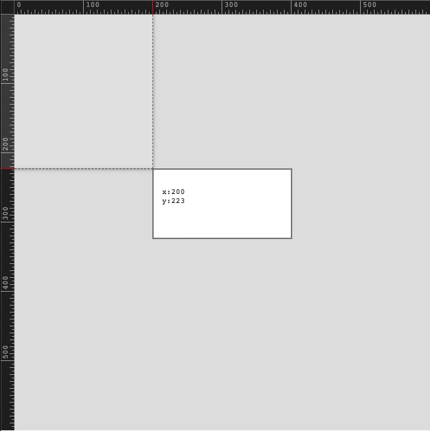
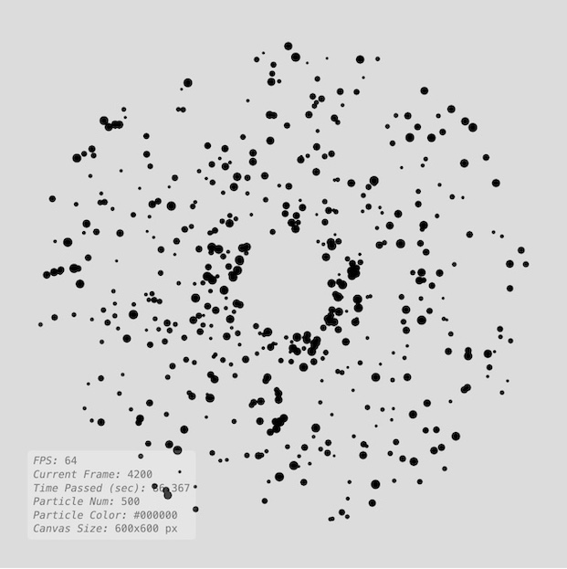

# p5.utils
 A set of utilities and additional features for my creative coding class aiming to help students while introducing the algorithmic thinking.  

## The list of utilities in p5.Utils repository. Click on thumbnails to access examples;

[1_pixelRuler](https://github.com/alptugan/p5.utils/tree/main/examples/1_pixelRuler) | [2_debugView](https://github.com/alptugan/p5.utils/tree/main/examples/2_debugView) | [3_getTimeStamp](https://github.com/alptugan/p5.utils/tree/main/examples/3_getTimeStamp)
------------- | ------------- | -------------
<a href="https://github.com/alptugan/p5.utils/tree/main/examples/1_pixelRuler"></a>  | <a href="https://github.com/alptugan/p5.utils/tree/main/examples/2_debugView"></a> | <a href="https://github.com/alptugan/p5.utils/tree/main/examples/3_getTimeStamp"></a>

[4_saveCanvas](https://github.com/alptugan/p5.utils/tree/main/examples/4_saveCanvas) | [5_arrayResize](https://github.com/alptugan/p5.utils/tree/main/examples/5_arrayResize) | [6_fxShadow](https://github.com/alptugan/p5.utils/tree/main/examples/6_fxShadow)
------------- | ------------- | -------------
<a href="https://github.com/alptugan/p5.utils/tree/main/examples/4_saveCanvas"></a> | <a href="https://github.com/alptugan/p5.utils/tree/main/examples/5_arrayResize"></a> | <a href="https://github.com/alptugan/p5.utils/tree/main/examples/6_fxShadow"></a>

[7_GradientFill](#) | [8_](#) | [9_](#)
------------- | ------------- | -------------
<a href="#"></a>  | <a href="#"></a> | <a href="#"></a>

## How to use p5.Utils library?
---
### Option 1
1. [Navigate to p5JS examples collection.](https://editor.p5js.org/alptugan/collections/tUYB1Fn4b)
2. Click on p5.utils.template.
3. Hit CMD+s (or File->Save). This will create a copy of required files in your P5JS account. 

### Option 2
1. Download the final minified js version from ["Releases" page](https://github.com/alptugan/p5.utils/releases/download/v0.0.1/p5.utils.min.js).
2. Upload ```p5.utils.min.js``` to your project folder in p5 editor.
3. Include the ```p5.utils.min.js``` in the ```index.html``` document before p5.js libs as follows;
     ```
     <script src="libraries/p5.min.js"></script>
     <script src="libraries/p5.sound.min.js"></script>
     <script src="libraries/p5.utils.min.js"></script>
     ```
4. Declare and initialize the lib before the ```setup()``` prefably as follows;

     ```
     var utils = new p5.Utils();
     ```
5. Now you can call any <a href="#functions">methods</a> defined in ```p5.utils``` library using dot notation as follows in ```setup()``` or any other custom methods in your code;

     ```
     utils.enablerRuler(); 
     ```

## Reference
---
### p5.Utils library
p5.Utils extends p5 with several functionalities including cheaper drawingcontext effects, pixel ruler (useful for new commers), array operations, file naming, dom based debug window to avoid rendering text in p5JS.

<a name="functions"></a>
## Functions

<dl>
<dt><a href="#debug">debug(_itemName)</a></dt>
<dd><p>Creates Debug Div cause p5 font is expensive.</p>
</dd>
<dt><a href="#getTimeStamp">getTimeStamp([_date])</a> ⇒ <code>String</code></dt>
<dd><p>Timestamp function useful for file naming to avoid overwrite issues.</p>
</dd>
<dt><a href="#saveCanvas">saveCanvas([_prefix], [_suffix])</a></dt>
<dd><p>Utilizes p5JS saveCanvas function to make it easier file saving process by combining the function with getTimeStamp() method.</p>
</dd>
<dt><a href="#beginShadow">beginShadow(_color, _shadowBlur, _shadowOffsetX, _shadowOffsetY)</a></dt>
<dd><p>Creates shadow effect usign drawing context. Must be used with <a href="#endShadow">endShadow</a> method. See examples for how to use it.</p>
</dd>
<dt><a href="#endShadow">endShadow()</a></dt>
<dd><p>Stops shadow effect for the following graphics on the canvas.</p>
</dd>
<dt><a href="#beginLinearGradient">beginLinearGradient(_colorsArr, _startX, _startY, _endX, _endY, _colorsRatio)</a></dt>
<dd><p>Default Context 2D Gradient fill style. </p>
<p>Reference: <a><a href="https://developer.mozilla.org/en-US/docs/Web/API/CanvasRenderingContext2D/createLinearGradient">https://developer.mozilla.org/en-US/docs/Web/API/CanvasRenderingContext2D/createLinearGradient</a></a></p>
</dd>
<dt><a href="#endLinearGradient">endLinearGradient()</a></dt>
<dd><p>Stop Gradient fill for the following graphics.</p>
</dd>
<dt><a href="#disableRuler">disableRuler()</a></dt>
<dd><p>Removes the ruler graphics from the canvas.</p>
</dd>
<dt><a href="#enableRuler">enableRuler()</a></dt>
<dd><p>Ruler for newcomers to show pixel meter</p>
</dd>
</dl>

<a name="debug"></a>

## debug(_itemName)
Create Debug Div cause p5 font is expensive.

**Kind**: global function  

| Param | Type | Description |
| --- | --- | --- |
| _itemName | <code>Object.&lt;string, number&gt;</code> \| <code>Object.&lt;string, string&gt;</code> | The argument must be in JSON data format. The function automatically parses "keys" to titles and their "values" next to them. You can add as many objects as you want. |

**Example** *(How to use debug() method.)*  
```js
// Define global variable and initialize p5.Utils lib
var utils = new p5.Utils();

utils.debug(
{
   "FPS": frameRate().toFixed(0),
   "Frequency": frequency.toFixed(3)
});
```
<a name="getTimeStamp"></a>

## getTimeStamp([_date]) ⇒ <code>String</code>
Timestamp function useful for file naming to avoid overwrite issues.

**Kind**: global function  
**Returns**: <code>String</code> - Current date + time depending on _date argument value. 
When _date = true;
The return format is Year-Month-Day_Hour-Minute-Second
When _date = false;
 The return format is Hour-Minute-Second  

| Param | Type | Default | Description |
| --- | --- | --- | --- |
| [_date] | <code>boolean</code> | <code>true</code> | If true -> Timestamp within Year-Month-Day |

**Example**  
```js
// Define global variable and initialize p5.Utils lib
var utils = new p5.Utils();
var currentTime = utils.getTimeStamp();
```
<a name="saveCanvas"></a>

## saveCanvas([_prefix], [_suffix])
Utilizes p5JS saveCanvas function to make it easier file saving process by combining the function with getTimeStamp() method.

**Kind**: global function  

| Param | Type | Default | Description |
| --- | --- | --- | --- |
| [_prefix] | <code>String</code> \| <code>Number</code> | <code>&quot;&quot;</code> | Any relevant text in the begining of the file name. If it is leaved empty, the file name will be Year-Month-Day_Hour-Minute-Second.PNG |
| [_suffix] | <code>String</code> | <code>&quot;png&quot;</code> | The file extension JPG, PNG, ... |

**Example**  
```js
// Define global variable and initialize p5.Utils lib
var utils = new p5.Utils();
function keyPressed() {
     if(key == 's') {
         utils.saveCanvas("myProject", "png");
         // or without any argument
         // utils.saveCanvas();
     }
}
```
<a name="beginShadow"></a>

## beginShadow(_color, _shadowBlur, _shadowOffsetX, _shadowOffsetY)
Creates shadow effect usign drawing context. Must be used with [endShadow](#endShadow) method. See examples for how to use it.

**Kind**: global function  

| Param | Type | Description |
| --- | --- | --- |
| _color | <code>p5.Color</code> \| <code>String</code> | The color can be declared as ```color(r,g,b,a)``` or in hexadecimal format ```"#FFCC00"``` as string argument. |
| _shadowBlur | <code>Number</code> | Blur amount of the shadow. |
| _shadowOffsetX | <code>Number</code> | Shadow offset for x axis. |
| _shadowOffsetY | <code>Number</code> | Shadow offset for y axis. |

**Example**  
```js
var utils = new p5.Utils();
function setup() {
     createCanvas(400,400);
     rectMode(CENTER);
}

function draw() {
     utils.beginShadow("#000000", 5, 10, 10);
     rect(width*0.5, height*0.5, 100, 100);
     utils.endShadow();
}
```
<a name="endShadow"></a>

## endShadow()
Stops shadow effect for the following graphics on the canvas.

**Kind**: global function  
**See**: For example usage [beginShadow](#beginShadow) page.  
<a name="beginLinearGradient"></a>

## beginLinearGradient(_colorsArr, _startX, _startY, _endX, _endY, _colorsRatio)
Default Context 2D Gradient fill style. 

Reference: <a>https://developer.mozilla.org/en-US/docs/Web/API/CanvasRenderingContext2D/createLinearGradient</a>

**Kind**: global function  

| Param | Type | Description |
| --- | --- | --- |
| _colorsArr | <code>Array.&lt;p5.Color&gt;</code> \| <code>Array.&lt;Number&gt;</code> \| <code>Array.&lt;String&gt;</code> | List of colors in the gradient fill. |
| _startX | <code>Number</code> | The x-axis coordinate of the start point. |
| _startY | <code>Number</code> | The y-axis coordinate of the start point. |
| _endX | <code>Number</code> | The x-axis coordinate of the end point. |
| _endY | <code>Number</code> | The y-axis coordinate of the end point. |
| _colorsRatio | <code>Array.&lt;Number&gt;</code> | The distribution weight of colors. The values must be between 0 - 1. Conventionally, if you include three colors, set the first one to 0, the last one to 1, and the middle one depends on your choice(0-1). The method automatically assign start and stop values, if you do not specify any value they will be generated randomly. |

**Example**  
```js
// Define global variable and initialize p5.Utils lib
var utils = new p5.Utils();

function setup() {
     createCanvas(400,400);
}

function draw() {
     utils.beginLinearGradient(
     [color(100,100,0),color(100,130,200)], 
     width*0.5 - 100, 
     height*0.5 - 100, 
     width*0.5+100, 
     height*0.5+100);
     circle(width*0.5, height*0.5,500);
     utils.endLinearGradient();
}
```
<a name="endLinearGradient"></a>

## endLinearGradient()
Stop Gradient fill for the following graphics.

**Kind**: global function  
**See**: For example usage [beginLinearGradient](#beginLinearGradient) page.  
<a name="disableRuler"></a>

## disableRuler()
Removes the ruler graphics from the canvas.

**Kind**: global function  
**See**: For example usage [enableRuler](#enableRuler) page.  
<a name="enableRuler"></a>

## enableRuler()
Ruler for newcomers to show pixel meter

**Kind**: global function  
**Example**  
```js
// Define global variable and initialize p5.Utils lib
var utils = new p5.Utils();

function setup() {
     createCanvas(400,400);
     
     // No need to run in draw function
     // The function creates its canvases in a different drawing context
     utils.enableRuler();
}

function draw() {
     background(220);
     rect(width*0.5, height*0.5,500, 500);
}

function keyPressed() {
     if(key == 'h') {
         utils.disableRuler();
     }
}
```

